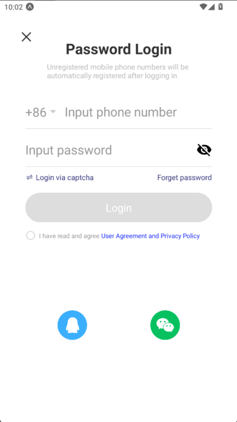
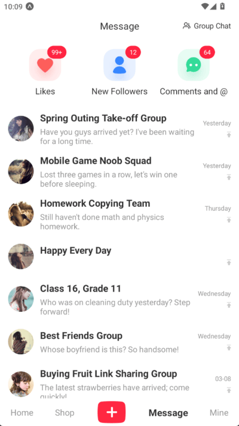
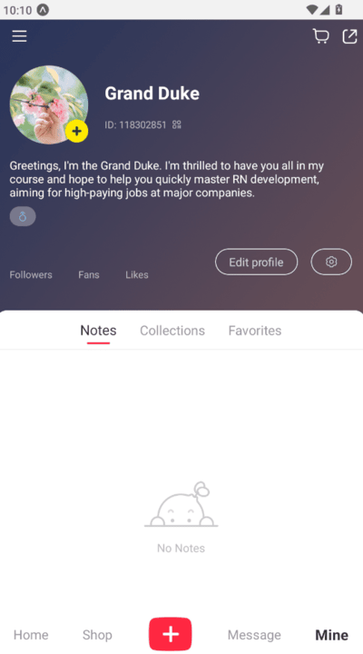
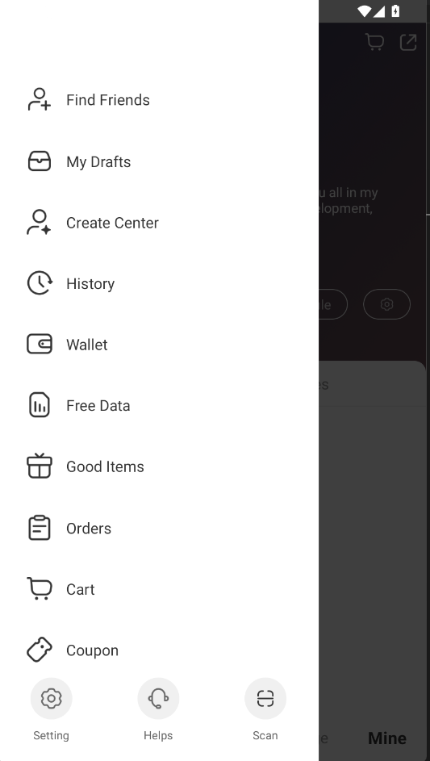

# Read Book -- React-Native Project(Based on Expo Framework)

## Description
XiaoHongShu app is a popular blog sharing app in China. I use React-Native to simluate its frontend UI, and implement some essiential functions like user login, render article list in home page, etc. All data is from backend server built by NodeJS.(You can find it in another repository).

## Run
1. Enter the project directory and install dependencies: `npm install`;
2. Use `npx expo run` to start the metro server;
3. For physical device debug, ensure you have installed "Expo go" on your device, open it and scan the QR code that is from terminal;
4. For emulator, press corresponding keys. You can find instruction from terminal as well.